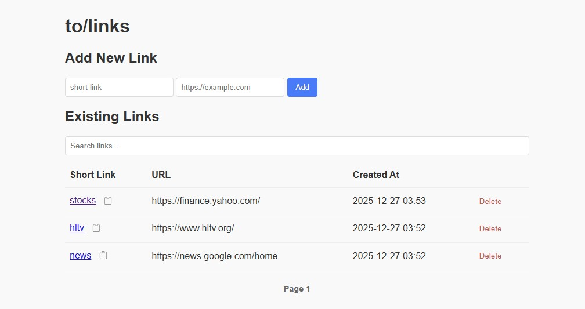
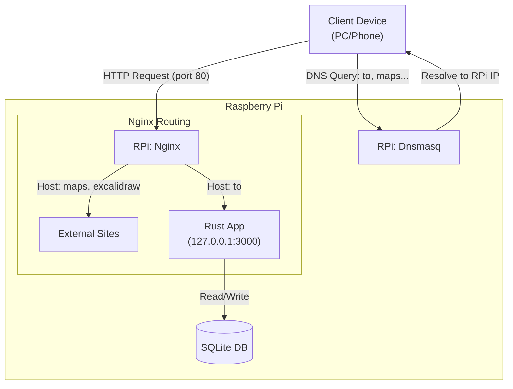

# Raspberry Pi Shortcut Network

> **Note:** This is a personal project created primarily for my own use and to fit my specific home network setup.



This project provides a local DNS-based shortcut system for your home network.
- `http://maps/` and `http://excalidraw/` are static Nginx redirects (as an examples, you can add/delete as you wish)
- `http://to/` handles dynamic user-defined links stored in SQLite.
- `http://to/link` provides a management UI powered by Rust & HTMX.

## Features

- **Dashboard**: Manage all your short links at `http://to/link`.
- **Fuzzy Search**: Find links quickly even with typos (powered by SQLite FTS5).
- **Copy to Clipboard**: Quickly share your shortcuts.
- **Smart 404 Handling**: If you navigate to a non-existent short link (e.g., `http://to/new-idea`), the app acts as a creation page, prompting you to define the target URL immediately.
- **Fast & Lightweight**: Built with Rust, Axum, and SQLite for minimal resource usage on Raspberry Pi.

## Architecture



## Setup & Deployment

### 1. Configure Environment
Copy the example environment file and fill in your Raspberry Pi's details (IP, user, target directory):
```bash
cp .env.example .env
# Edit .env with your favorite editor
```

### 2. DNS Server Configuration (dnsmasq)
Ensure `/etc/dnsmasq.conf` on your Raspberry Pi includes:
```text
expand-hosts
domain=lan
local=/lan/
```

### 3. Deploy
The provided `deploy.sh` script handles building (using `cross` or `cargo`), generating configuration files from templates, and installing the systemd service.

```bash
chmod +x deploy.sh
./deploy.sh
```

## Manual Configurations (If needed)

### Nginx Configuration
The deployment script generates a tailored configuration at `nginx/to-links.conf`. To enable it manually:
```bash
sudo cp nginx/to-links.conf /etc/nginx/sites-available/
sudo ln -s /etc/nginx/sites-available/to-links.conf /etc/nginx/sites-enabled/
sudo nginx -t && sudo systemctl reload nginx
```

### Dnsmasq Shortcuts
The script generates `dnsmasq/shortcuts.conf` with your RPi's IP. You can include this in your dnsmasq configuration or copy its contents to `/etc/hosts`.

