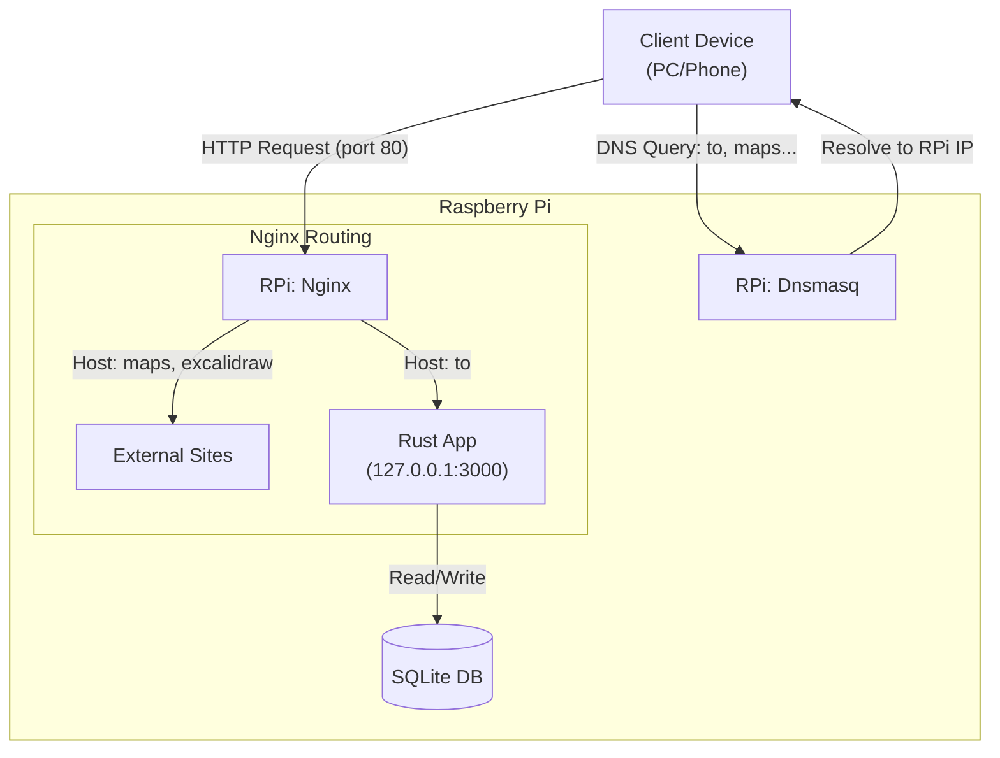

# Raspberry Pi Shortcut Network

This project provides a local DNS-based shortcut system for your home network.
- `http://maps/` and `http://excalidraw/` are static Nginx redirects (as an examples, you can add/delete as you wish)
- `http://to/` handles dynamic user-defined links stored in SQLite.
- `http://to/link` provides a management UI powered by Rust & HTMX.

## Features

- **Dashboard**: Manage all your short links at `http://to/link`.
- **Smart 404 Handling**: If you navigate to a non-existent short link (e.g., `http://to/new-idea`), the app acts as a creation page, prompting you to define the target URL immediately.
- **Fast & Lightweight**: Built with Rust, Axum, and SQLite for minimal resource usage on Raspberry Pi.

## Architecture



## DNS Server Configuration (dnsmasq)
Ensure `/etc/dnsmasq.conf` on your Raspberry Pi includes:
```text
expand-hosts
domain=lan
local=/lan/
```

## Local Hosts Entry
Add your Raspberry Pi's IP and the hostnames to /etc/hosts:

```text
192.168.1.78  to maps excalidraw
```

## Nginx Configuration
Copy `./nginx/to-links.conf` to `/etc/nginx/sites-available/`

Enable it and restart Nginx:

```bash
sudo ln -s /etc/nginx/sites-available/to-links.conf /etc/nginx/sites-enabled/
sudo nginx -t && sudo systemctl reload nginx
```

## Rust Application Setup

Build the binary: `cargo build --release`

Run the application: `./target/release/to-link-app` Note: The app listens on 127.0.0.1:3000 by default.

## Cross-compilation and deployment

### Prerequisites

1.  **Cross-Compilation Target**:
    ```bash
    rustup target add aarch64-unknown-linux-gnu
    ```
2.  **Linker**: Install `aarch64-linux-gnu-gcc` on your host system.
    [Optional] you can install `cross` to make it easier:
    ```bash
    cargo install cross
    ```
3.  **SSH**: SSH public key authentication should be configured for user `drjackild` on `rpi-b`.

### Deployment Script

Use the provided `deploy.sh` script to build and upload the binary:

```bash
chmod +x deploy.sh
./deploy.sh
```

## Systemd Service Configuration

On the Raspberry Pi, create the service file at `/etc/systemd/system/to-links.service`:

```ini
[Unit]
Description=To-Links Shortener Service
After=network.target

[Service]
Type=simple
User=drjackild
WorkingDirectory=/home/drjackild/to-links
# Starts the app and points to the database file in the same directory
ExecStart=/home/drjackild/to-links/to-links-app --db /home/drjackild/to-links/app.db
Restart=always
Environment=RUST_LOG=info

[Install]
WantedBy=multi-user.target
```

### Management Commands

Once the service file is created, run these commands on the RPi:

```bash
sudo systemctl daemon-reload
sudo systemctl enable --now to-links
sudo systemctl status to-links
```

## Client Machine Setup (Windows/Mac)
Ensure your machine's DNS is pointing to the Raspberry Pi IP.

